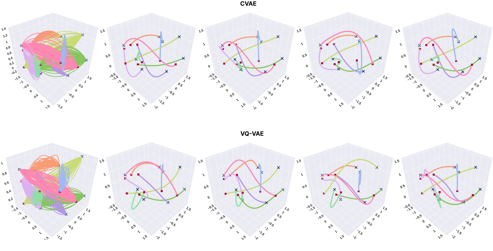

### Swarm-Gen: Fast Generation of Diverse Feasible Swarm Behaviors

This repository contains the source code to reproduce the experiments in our paper: "Swarm-Gen: Fast Generation of Diverse Feasible Swarm Behaviors" where we combine a generative model (CVAE/VQ-VAE) with a safty filter (SF) to learn to generate diverse swarm behavior trajectories given a fixed start and goal points.

